# Rology Live Ultrasound - Solution Architecture

A real-time web application enabling remote radiologists to collaborate live with ultrasound technicians during scans, featuring WebRTC video/screen sharing, annotations, and AI-assisted report generation.

---

## System Overview


---

## Component Architecture

### Frontend Components

| Component | Purpose |
|-----------|---------|
| `App.tsx` | Landing page with role selection (Tech/Radiologist) |
| `TechDashboard.tsx` | Technician interface with ultrasound controls |
| `RadDashboard.tsx` | Radiologist interface with DICOM viewer & annotations |
| `DicomViewer.tsx` | Cornerstone.js-based medical image viewer |
| `Chat.tsx` | Real-time text messaging between users |
| `ReportSidebar.tsx` | AI-assisted report generation panel |

### Backend Services

| Service | Port | Purpose |
|---------|------|---------|
| Vite Dev Server | 3000 | Serves React frontend |
| Signaling Server | 3001 | Socket.io room management & WebRTC signaling |

---

## Network Architecture

```mermaid
sequenceDiagram
    participant Tech as 💻 Tech Laptop
    participant Server as 🖥️ Signaling Server<br/>(192.168.1.7:3001)
    participant Rad as 💻 Radiologist Laptop
    
    Tech->>Server: Connect via Socket.io
    Tech->>Server: join({ roomId: "room-test1", role: "TECH" })
    Server-->>Tech: room-info (1 user)
    
    Rad->>Server: Connect via Socket.io
    Rad->>Server: join({ roomId: "room-test1", role: "RADIOLOGIST" })
    Server-->>Rad: room-info (2 users)
    Server-->>Tech: signal({ type: "JOIN", role: "RADIOLOGIST" })
    
    Note over Tech, Rad: Real-time sync begins
    
    Tech->>Server: signal({ type: "SYNC_STATE", gain: 50 })
    Server->>Rad: signal({ type: "SYNC_STATE", gain: 50 })
    
    Rad->>Server: signal({ type: "CHAT", text: "Adjust depth" })
    Server->>Tech: signal({ type: "CHAT", text: "Adjust depth" })
```



---

## Data Flow

### 1. Session Initiation
1. Both users navigate to `http://<server-ip>:3000`
2. Enter same **Room Code** (e.g., "US-101")
3. Select their role (Tech or Radiologist)

### 2. Real-Time Synchronization
- **State Sync**: Gain, depth, freeze controls synced via Socket.io
- **Chat**: Text messages broadcast to room participants
- **Annotations**: Drawing coordinates shared in real-time

### 3. Video Streaming (WebRTC)
- Tech's webcam/screen → Radiologist's viewer
- Peer-to-peer connection reduces latency
- Fallback to TURN server for NAT traversal

---

## Technology Stack

| Layer | Technology |
|-------|------------|
| **Frontend** | React 19, Vite, TypeScript, Tailwind CSS |
| **Medical Imaging** | Cornerstone.js, DICOM Parser |
| **Real-Time** | Socket.io, WebRTC |
| **Backend** | Node.js, Express |
| **PDF Generation** | jsPDF, html2canvas |

---

## Key Features

- ✅ **Multi-device Support**: Works across laptops on same network
- ✅ **Real-time Sync**: Sub-second latency for control sync
- ✅ **DICOM Viewer**: Native medical image format support
- ✅ **Live Annotations**: Draw on images in real-time
- ✅ **Voice Chat**: WebRTC-based audio communication
- ✅ **AI Reports**: Automated report generation

---

## Deployment

```bash
# Start signaling server
cd server && npm run start

# Start frontend dev server  
npm run dev

# Access from any device on network
http://<your-ip>:3000
```

> **Note**: Both devices must be on the same network and connect via the server's IP address (not localhost).
